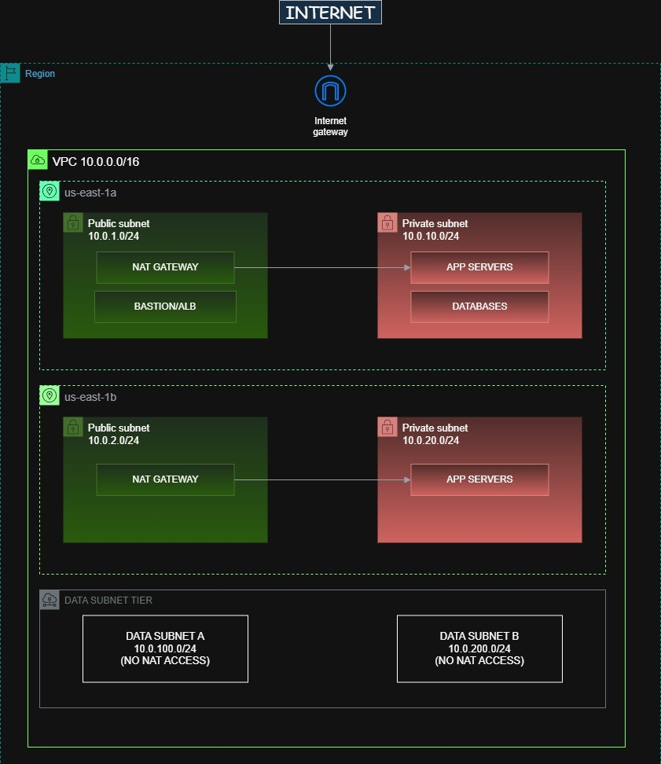

# Secure AWS VPC Using Infrastructure as Code (Terraform)

## Overview

This project demonstrates the design and deployment of a **secure three-tier AWS network architecture** using **Infrastructure as Code (Terraform)**.

The environment implements **network segmentation, least-privilege communication, private subnets, VPC endpoints, and centralized logging** to create a hardened cloud networking baseline suitable for modern application deployments.

The project also includes **security validation tests** that verify the effectiveness of the network controls.

---

# Architecture



---

## Traffic Flow Diagram

```
┌─────────────────────────────────────────────────────────────────────────────────┐
│                           NETWORK TRAFFIC FLOWS                                 │
└─────────────────────────────────────────────────────────────────────────────────┘

INBOUND (User Request):
═══════════════════════

    Internet
       │
       ▼
┌──────────────┐     ┌──────────────┐     ┌──────────────┐     ┌──────────────┐
│   Internet   │────▶│     ALB      │────▶│  App Server  │────▶│   Database   │
│   Gateway    │     │  (Public)    │     │  (Private)   │     │    (Data)    │
└──────────────┘     └──────────────┘     └──────────────┘     └──────────────┘
                           │                    │                     │
                           ▼                    ▼                     ▼
                     SG: 443 only         SG: ALB only          SG: App only
                     from internet        on port 8080          on port 5432


OUTBOUND (Server Updates):
══════════════════════════

┌──────────────┐     ┌──────────────┐     ┌──────────────┐
│  App Server  │────▶│ NAT Gateway  │────▶│   Internet   │
│  (Private)   │     │  (Public)    │     │   Gateway    │──────▶ Internet
└──────────────┘     └──────────────┘     └──────────────┘

    Route table:                Route table:
    0.0.0.0/0 → NAT             0.0.0.0/0 → IGW


DATA TIER (Isolated):
═════════════════════

┌──────────────┐     ┌──────────────┐
│   Database   │  ✗  │   Internet   │    NO outbound internet access
│   (Data)     │─────│              │    Must use VPC endpoints for
└──────────────┘     └──────────────┘    AWS service access
```

## Security Layers

```
┌─────────────────────────────────────────────────────────────────────────────────┐
│                        DEFENSE IN DEPTH LAYERS                                  │
└─────────────────────────────────────────────────────────────────────────────────┘

     LAYER 1: Network ACLs (Subnet Level - Stateless)
     ═════════════════════════════════════════════════
     ┌─────────────────────────────────────────────────────────────────┐
     │  NACL: Default deny + explicit allows                          │
     │  • Inbound: Allow 443 from 0.0.0.0/0 to public subnets        │
     │  • Inbound: Allow ephemeral ports for return traffic           │
     │  • Outbound: Allow all to 0.0.0.0/0 (stateless, need return)  │
     └─────────────────────────────────────────────────────────────────┘
                                    │
                                    ▼
     LAYER 2: Security Groups (Instance Level - Stateful)
     ═════════════════════════════════════════════════════
     ┌─────────────────────────────────────────────────────────────────┐
     │  SG: Reference other SGs, not CIDR blocks                      │
     │                                                                 │
     │  ┌─────────────┐    ┌─────────────┐    ┌─────────────┐         │
     │  │   ALB-SG    │───▶│   App-SG    │───▶│   DB-SG     │         │
     │  │ In: 443/any │    │ In: 8080    │    │ In: 5432    │         │
     │  │             │    │    from     │    │    from     │         │
     │  │             │    │   ALB-SG    │    │   App-SG    │         │
     │  └─────────────┘    └─────────────┘    └─────────────┘         │
     └─────────────────────────────────────────────────────────────────┘
                                    │
                                    ▼
     LAYER 3: Host-Based Controls (OS Level)
     ═════════════════════════════════════════
     ┌─────────────────────────────────────────────────────────────────┐
     │  • iptables/nftables on Linux                                  │
     │  • Application-level authentication                            │
     │  • TLS everywhere                                              │
     └─────────────────────────────────────────────────────────────────┘
```
---

# Infrastructure Components

### Networking

* Public Subnets (Load Balancer)
* Private Subnets (Application Tier)
* Data Subnets (Database Tier)

### Security Controls

* Network ACL segmentation
* Security Groups enforcing least privilege
* Private instances without public IPs
* Internet Gateway for public tier only

### Observability

* VPC Flow Logs
* CloudWatch Logs Endpoint

### Service Access

* S3 Gateway Endpoint
* CloudWatch Logs Interface Endpoint

---

# Infrastructure as Code

All infrastructure is provisioned using **Terraform**.

Key Terraform modules:

| File                 | Purpose                           |
| -------------------- | --------------------------------- |
| `vpc.tf`             | VPC definition                    |
| `subnets.tf`         | Public, private, and data subnets |
| `route_tables.tf`    | Routing configuration             |
| `security_groups.tf` | Instance security controls        |
| `nacls.tf`           | Subnet-level network filtering    |
| `endpoints.tf`       | VPC endpoints                     |
| `flow_logs.tf`       | VPC traffic logging               |
| `outputs.tf`         | Terraform outputs                 |

---

# Network Segmentation

| Tier    | Access            | Purpose                   |
| ------- | ----------------- | ------------------------- |
| Public  | Internet          | Application Load Balancer |
| Private | ALB only          | Application servers       |
| Data    | Private tier only | Database                  |

Allowed traffic flows:

```
Internet → ALB (443)
ALB → Application Tier (8080)
Application Tier → Database (5432)
```

All other traffic paths are blocked.

---

# Security Controls

This architecture implements multiple layers of defense:

### 1. Network ACLs

Subnet-level traffic filtering to enforce segmentation.

### 2. Security Groups

Instance-level rules enforcing least privilege.

### 3. Private Subnets

Application and database tiers have **no public internet access**.

### 4. VPC Endpoints

Secure access to AWS services without traversing the public internet.

### 5. VPC Flow Logs

Network traffic monitoring and auditing.

---

# Threat Model

| Threat                             | Mitigation                    |
| ---------------------------------- | ----------------------------- |
| Direct internet access to database | Data subnet isolation         |
| Unauthorized inbound traffic       | Security group restrictions   |
| Lateral movement between tiers     | Network ACL segmentation      |
| Data exfiltration                  | Endpoint-based service access |
| Unmonitored network activity       | VPC Flow Logs                 |

---

# Project Structure

```
aws-secure-vpc-terraform
│
├── terraform
│   ├── vpc.tf
│   ├── subnets.tf
│   ├── route_tables.tf
│   ├── security_groups.tf
│   ├── nacls.tf
│   ├── endpoints.tf
│   ├── flow_logs.tf
│   └── outputs.tf
│
├── diagrams
│   └── architecture.py
│
├── docs
│   ├── architecture.png
│   ├── security-tests.md
│   ├── threat-model.md
│   └── screenshots
│
└── README.md
```

---

# Deployment

### Initialize Terraform

```
terraform init
```

### Review Infrastructure Plan

```
terraform plan
```

### Deploy Infrastructure

```
terraform apply
```

---

# Destroy Infrastructure

To avoid unnecessary AWS charges:

```
terraform destroy
```

---

# Key Skills Demonstrated

* AWS VPC Architecture
* Infrastructure as Code (Terraform)
* Cloud Network Security
* Network Segmentation
* Endpoint-based AWS service access
* Cloud observability with VPC Flow Logs
* Security validation testing

---

# License

This project is provided for educational and portfolio purposes.
