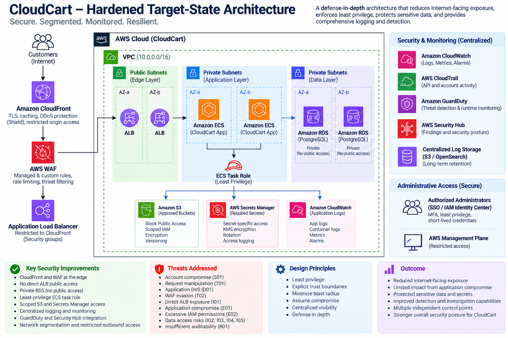

# CloudCart — AWS Cloud Security Threat Modeling & Security Assessment

CloudCart is a portfolio project that simulates an end-to-end cloud security assessment of an AWS-hosted e-commerce environment.

The project covers:

* AWS architecture and trust-boundary analysis
* STRIDE threat modeling
* Cloud attack-path analysis
* Risk scoring and prioritization
* Remediation planning
* Detection engineering
* Incident response
* Hardened target-state architecture

---

## Project Objective

The central question behind the assessment is:

> If the Internet-facing application is compromised, how far could an attacker progress through the AWS environment, and what controls would limit the blast radius?

The primary attack path identified was:

```text
Internet
   ↓
Application Exploitation
   ↓
ECS Workload Compromise
   ↓
AWS Workload Identity Abuse
   ↓
Excessive IAM Permissions
   ↓
Sensitive AWS Resources
   ├── S3
   ├── Secrets Manager
   └── RDS
```

This attack path is documented as **AP-01**.

---

## Architecture

CloudCart uses a simulated AWS architecture including:

* CloudFront
* AWS WAF
* Application Load Balancer
* Amazon ECS
* AWS IAM
* Amazon RDS PostgreSQL
* Amazon S3
* AWS Secrets Manager
* AWS KMS
* CloudWatch
* CloudTrail
* GuardDuty
* Security Hub

### Original Architecture


---

## Threat Modeling

The assessment uses **STRIDE** to evaluate threats across application processes, data stores, identities, and data flows.

Detailed analysis:

[`threat-model/stride-analysis.md`](./threat-model/stride-analysis.md)

The full threat register is available here:

[`threat-model/threat-register.md`](./threat-model/threat-register.md)

---

## Risk Assessment

Risk is calculated as:

```text
Risk Score = Likelihood × Impact
```

Likelihood and impact are scored from 1–5.

| Score | Rating   |
| ----: | -------- |
|   1–4 | Low      |
|   5–9 | Medium   |
| 10–16 | High     |
| 17–25 | Critical |

### Risk Matrix


Detailed assessment:

[`threat-model/risk-assessment.md`](./threat-model/risk-assessment.md)

---

## Key Findings

The assessment identified 15 primary threats.

The highest-priority findings were:

| ID  | Finding                       |  Risk |
| --- | ----------------------------- | ----: |
| E02 | Excessive ECS IAM permissions | 25/25 |
| E01 | Application compromise        | 20/25 |
| I02 | Unauthorized database access  | 20/25 |
| I04 | Public S3 exposure            | 20/25 |
| I05 | Secrets disclosure            | 20/25 |

The most significant issue was **excessive ECS IAM permissions**.

A compromised application may affect one workload, but an overprivileged workload identity can expand the blast radius into other AWS services.

---

## Primary Attack Path

The project focuses on the relationship between application compromise and workload identity:

```text
Application Compromise
        ↓
ECS Workload
        ↓
Task Role
        ↓
AWS APIs
        ↓
S3 / Secrets Manager / RDS
```

Detailed analysis:

[`threat-model/attack-paths.md`](./threat-model/attack-paths.md)

---

## Remediation

A 30/60/90-day remediation roadmap was created to prioritize:

* IAM least privilege
* S3 access controls
* Secrets Manager restrictions
* Private RDS access
* Application hardening
* ALB exposure reduction
* Improved logging and monitoring

Full roadmap:

[`remediation/remediation-roadmap.md`](./remediation/remediation-roadmap.md)

---

## Detection Engineering

The project includes detection use cases covering:

* Suspicious WAF activity
* Application exploitation indicators
* ECS runtime behavior
* Unexpected workload-role API activity
* Secrets Manager access
* S3 data access
* IAM privilege changes
* Security logging changes
* Public S3 configuration changes
* Authentication abuse

Detection documentation:

[`detection/detection-use-cases.md`](./detection/detection-use-cases.md)

---

## Incident Response

A SOC-style runbook was created for investigating AP-01.

The runbook covers:

* Alert triage
* Timeline reconstruction
* AWS identity analysis
* ECS investigation
* CloudTrail review
* Secrets and S3 investigation
* Containment
* Eradication
* Recovery
* Root-cause analysis

Runbook:

[`incident-response/ap01-incident-runbook.md`](./incident-response/ap01-incident-runbook.md)

---

## Hardened Target-State Architecture

The target-state architecture is designed around one principle:

> Application compromise should not automatically result in broader AWS compromise.

### Hardened Architecture



Key improvements include:

* Restricted ALB access
* Private RDS
* Least-privilege ECS task roles
* Scoped S3 permissions
* Secret-specific access
* Centralized logging
* GuardDuty and Security Hub
* Stronger network segmentation

Architecture details:

[`architecture/hardened-architecture.md`](./architecture/hardened-architecture.md)

---

## Repository Structure

```text
CloudCart/
├── architecture/
├── threat-model/
├── remediation/
├── detection/
├── incident-response/
└── README.md
```

---

## Skills Demonstrated

* AWS cloud security
* STRIDE threat modeling
* IAM least privilege
* Attack-path analysis
* Risk assessment
* Detection engineering
* CloudTrail investigation
* GuardDuty and Security Hub
* Incident response
* Security architecture

---

## Key Takeaway

The central lesson from the CloudCart assessment is that **workload identity determines blast radius**.

The architecture should assume that an application may eventually be compromised and limit what that compromised workload can access.

The security model therefore focuses on:

```text
Prevent compromise
        ↓
Limit permissions
        ↓
Restrict sensitive-resource access
        ↓
Detect abnormal identity behavior
        ↓
Respond quickly
```

---

## Disclaimer

CloudCart is a fictional environment created for educational and portfolio purposes. The architecture, threats, incidents, and telemetry in this repository are simulated.
