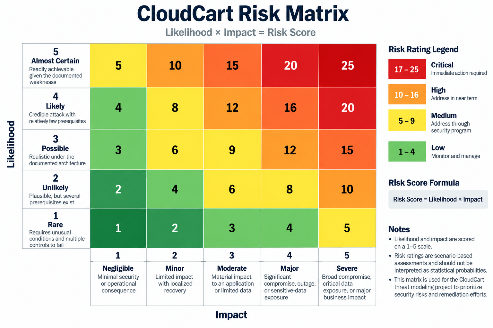

# CloudCart Risk Assessment

## 1. Purpose

This document prioritizes the security threats identified during the CloudCart threat modeling exercise.

Risk is evaluated using a qualitative scoring model based on:

**Risk Score = Likelihood × Impact**

The assessment is designed to identify threats requiring immediate remediation, establish remediation priorities, and support the security findings documented in the CloudCart threat register.

---

## 2. Risk Scoring Methodology

Likelihood and impact are independently scored from 1 to 5.

### Likelihood

| Score | Rating         | Definition                                                |
| ----: | -------------- | --------------------------------------------------------- |
|     1 | Rare           | Requires unusual conditions and multiple controls to fail |
|     2 | Unlikely       | Plausible, but several prerequisites exist                |
|     3 | Possible       | Realistic under the documented architecture               |
|     4 | Likely         | Credible attack with relatively few prerequisites         |
|     5 | Almost Certain | Readily achievable given the documented weakness          |

### Impact

| Score | Rating     | Definition                                                         |
| ----: | ---------- | ------------------------------------------------------------------ |
|     1 | Negligible | Minimal security or operational consequence                        |
|     2 | Minor      | Limited impact with localized recovery                             |
|     3 | Moderate   | Material impact to an application or limited data                  |
|     4 | Major      | Significant compromise, outage, or sensitive-data exposure         |
|     5 | Severe     | Broad compromise, critical data exposure, or major business impact |

### Risk Rating

| Score | Rating   |
| ----: | -------- |
|   1–4 | Low      |
|   5–9 | Medium   |
| 10–16 | High     |
| 17–25 | Critical |

Risk ratings are scenario-based assessments and should not be interpreted as statistical probabilities.

---

## 3. Risk Matrix



| Likelihood \ Impact  |  1 |  2 |     3 |      4 |      5 |
| -------------------- | -: | -: | ----: | -----: | -----: |
| **5 Almost Certain** |  5 | 10 |    15 |     20 | **25** |
| **4 Likely**         |  4 |  8 |    12 | **16** | **20** |
| **3 Possible**       |  3 |  6 | **9** |     12 |     15 |
| **2 Unlikely**       |  2 |  4 |     6 |      8 |     10 |
| **1 Rare**           |  1 |  2 |     3 |      4 |      5 |

---

## 4. Threat Risk Assessment

| ID  | Threat                         | Likelihood | Impact | Score | Rating   |
| --- | ------------------------------ | ---------: | -----: | ----: | -------- |
| S01 | Customer account compromise    |          4 |      4 |    16 | High     |
| T01 | Malicious request manipulation |          4 |      4 |    16 | High     |
| D01 | Application-layer DoS          |          3 |      4 |    12 | High     |
| T02 | WAF evasion                    |          3 |      3 |     9 | Medium   |
| I01 | Direct ALB exposure            |          3 |      4 |    12 | High     |
| E01 | Application compromise         |          4 |      5 |    20 | Critical |
| E02 | Excessive IAM permissions      |          5 |      5 |    25 | Critical |
| I02 | Unauthorized database access   |          4 |      5 |    20 | Critical |
| T03 | Database manipulation          |          3 |      5 |    15 | High     |
| I03 | Unauthorized S3 access         |          4 |      4 |    16 | High     |
| T04 | S3 object manipulation         |          3 |      4 |    12 | High     |
| I04 | Public S3 exposure             |          4 |      5 |    20 | Critical |
| I05 | Secrets disclosure             |          4 |      5 |    20 | Critical |
| I06 | Sensitive information in logs  |          3 |      3 |     9 | Medium   |
| R01 | Insufficient auditability      |          3 |      4 |    12 | High     |

---

## 5. Critical Risks

### E02 — Excessive IAM Permissions

**Risk Score:** 25/25
**Rating:** Critical

The ECS workload has excessive AWS permissions. If the application or workload is compromised, the attacker may inherit permissions that allow access to additional AWS resources.

This threat is particularly important because IAM permissions can amplify the impact of an application compromise.

**Primary controls:**

* Apply least-privilege IAM policies
* Restrict permissions to required AWS actions
* Restrict access to specific resources where possible
* Separate workload roles by application function
* Review permissions using IAM Access Analyzer
* Monitor unusual AWS API activity

---

### E01 — Application Compromise

**Risk Score:** 20/25
**Rating:** Critical

A vulnerability in the customer-facing application could provide an attacker with access to the ECS workload.

Potential vulnerability classes include:

* SSRF
* Injection vulnerabilities
* Authentication or authorization flaws
* Vulnerable dependencies
* Insecure file processing
* Application configuration weaknesses

Application compromise is particularly significant because it can become the initial stage of the AP-01 attack path.

---

### I02 — Unauthorized Database Access

**Risk Score:** 20/25
**Rating:** Critical

Compromise of the application or workload identity could provide unauthorized access to the RDS database.

Potential consequences include exposure or modification of customer and order data.

**Primary controls:**

* Private database networking
* Security-group restrictions
* Least-privilege database accounts
* Parameterized queries
* Secrets Manager
* TLS
* Encryption at rest
* Database auditing

---

### I04 — Public S3 Exposure

**Risk Score:** 20/25
**Rating:** Critical

Incorrect S3 access controls could expose objects to unauthorized users.

**Primary controls:**

* S3 Block Public Access
* Restrictive bucket policies
* Least-privilege IAM
* S3 Access Analyzer
* Encryption
* Versioning
* CloudTrail data-event logging for sensitive buckets

---

### I05 — Secrets Disclosure

**Risk Score:** 20/25
**Rating:** Critical

Secrets accessible to a compromised workload could allow additional access to databases, APIs, or other infrastructure.

**Primary controls:**

* Secret-specific IAM permissions
* Secrets Manager
* Secret rotation
* KMS encryption
* Secret access monitoring
* Prevention of secrets appearing in application logs

---

## 6. Attack-Path Risk

The primary compound attack path is:

```text
Internet
   ↓
CloudCart Application
   ↓
Application Vulnerability
   ↓
SSRF / Application Compromise
   ↓
ECS Workload
   ↓
IAM Workload Identity
   ↓
Excessive IAM Permissions
   ↓
AWS Resources
   ├── S3
   ├── Secrets Manager
   └── RDS
```

The attack path demonstrates why individual findings should not be evaluated in isolation.

For example:

```text
Application vulnerability
        +
Excessive IAM permissions
        +
Broad access to sensitive resources
        =
Significantly increased compromise impact
```

The highest-priority remediation therefore focuses on breaking the attack chain at multiple points rather than relying on a single defensive control.

---

## 7. Remediation Priority

### Priority 1 — Critical

Address immediately:

* E02 — Excessive IAM permissions
* E01 — Application compromise
* I02 — Unauthorized database access
* I04 — Public S3 exposure
* I05 — Secrets disclosure

### Priority 2 — High

Address after or alongside critical findings:

* S01 — Customer account compromise
* T01 — Malicious request manipulation
* D01 — Application-layer DoS
* I01 — Direct ALB exposure
* T03 — Database manipulation
* I03 — Unauthorized S3 access
* T04 — S3 object manipulation
* R01 — Insufficient auditability

### Priority 3 — Medium

Address through the security hardening program:

* T02 — WAF evasion
* I06 — Sensitive information in logs

---

## 8. Key Security Conclusions

The CloudCart threat model identifies IAM and workload compromise as major security control points.

The most significant systemic risk is the combination of:

1. A customer-facing application that may be compromised.
2. An ECS workload with excessive IAM permissions.
3. Access from that workload to sensitive AWS resources.
4. Sensitive customer and business data stored in those resources.

The recommended security strategy is therefore to implement defense in depth across:

* Application security
* IAM
* Network segmentation
* Data protection
* Secrets management
* Logging and monitoring
* AWS-native detection services

No single control should be treated as sufficient to prevent the complete AP-01 attack path.
